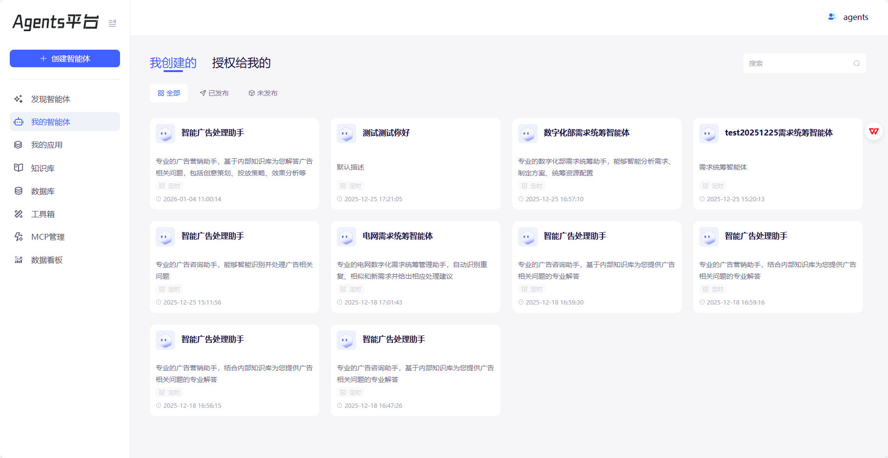

产品需求文档（PRD）
智能体工作流自动化平台（AgentFlow Studio）
版本：1.0
目标用户：AI 应用开发者、业务分析师、企业技术团队
对标产品：Dify、阿里云百炼、百度千帆
核心定位：通过自然语言或可视化拖拽，快速构建、部署、管理可执行的智能体工作流，并支持跨环境迁移。

一、产品愿景

打造一款轻量级、开源友好、标准化的智能体开发平台，让用户无需深度编码即可构建复杂 AI 应用。平台以 “Text-to-Agent” + “可视化编排” 双模式驱动，所有智能体均可通过 标准 JSON 格式导入/导出，并在底层由 LangGraph ≥1.0 高效执行，元数据持久化于 SQLite，后端服务基于 Python 3.12+ FastAPI 提供高性能 REST API。前端用 React Flow实现。要求python基于conda构建env，后端代码在这个env下进行运行。

二、核心功能模块
1. 智能体构建（双模式）
模式 描述

---
自然语言生成（Text-to-Agent） 用户输入一段描述（如“创建一个能查订单、改地址、调用 Python 处理退款的客服机器人”），系统自动生成初始工作流草稿
可视化编排 用户通过拖拽组件、连线、配置参数，手动构建或调整工作流
✅ 两种模式可互相切换：文本生成 → 可视化编辑 → 再导出为 JSON。

2. 可视化编排器 —— 支持全部标准组件
平台内置以下 5 大类、20+ 标准组件，均支持配置、连接与调试：
A. 理解 & 生成
大模型：调用 LLM 进行推理、生成、总结
智能体：嵌套调用其他已保存的智能体（子流程）
B. 工具引入
组件：调用平台内置工具（OCR、翻译等）
API：配置并调用任意 HTTP 接口
MCP Server：接入符合 MCP 协议的模型/控制器服务
函数计算 CFC：触发云函数（如阿里云 FC）
C. 业务逻辑
意图识别：NLU 分类用户意图
分支器：条件判断（if/else）
循环：遍历列表项
代码：执行 Python 脚本（沙箱安全）
参数聚合：合并字段为结构化对象
全局跳转：强制跳转至任意节点
跳出循环：提前退出当前循环
D. 信息 & 知识
知识库：RAG 向量检索
记忆变量：读写对话状态（短期/长期）
Query 改写：优化检索语句
数据库：查询 SQLite/MySQL/PostgreSQL
文本处理：清洗、摘要、分词等
流式数据处理：接入实时数据源（WebSocket/Kafka）
E. 输入 & 输出
信息收集：等待用户输入（表单、语音等）
消息节点：输出最终响应（文本/卡片/图片）
📌 所有组件必须支持：
输入/输出端口连接
参数配置面板（含变量绑定 {{var}}）
错误处理策略（重试、默认值、失败跳转）

3. 智能体管理
创建/编辑/复制/删除 智能体
版本快照：每次修改自动保存历史版本
启停控制：启用/禁用智能体
运行日志：记录每次执行的输入、路径、输出、耗时
权限控制：支持基础角色区分（未来可扩展团队协作）

4. 导入/导出中心（关键能力）
导出为 JSON：
一键导出当前智能体为标准 JSON 文件
包含完整节点、边、工具、LLM 配置等信息
符合平台定义的 [Agent JSON Schema v1.0]
从 JSON 导入：
上传 JSON 文件，自动重建智能体
自动校验依赖项（如工具、知识库是否存在）
支持批量导入（用于 CI/CD 或迁移）
💡 设计原则：JSON 是智能体的“唯一事实源”，确保跨环境一致性。

5. 工具与知识库管理
工具管理：
注册自定义工具（HTTP API / Python 函数）
测试工具连通性
分类、搜索、共享工具
知识库管理：
上传文档（PDF/TXT/Markdown）
自动切片 + 嵌入（支持 Qwen/Qwen-Embedding）
配置检索参数（top_k、相似度阈值）

三、非功能性需求

类别 要求

---
技术栈 后端：Python + FastAPI；数据库：SQLite（单文件）；运行时：LangGraph ≥1.0
部署模式 默认单机部署（适合本地/边缘场景），支持 Docker 容器化
安全性 代码块执行需沙箱隔离；API 调用支持 Token 认证；敏感配置加密存储
性能 单智能体并发支持 ≥50 请求/秒（本地 SQLite + 异步 FastAPI）
可观测性 提供执行日志、节点耗时、错误堆栈
开放性 提供完整 OpenAPI 文档，支持第三方集成

四、用户旅程示例

1. 用户 A（开发者）：
在 UI 中拖拽“意图识别 → 分支器 → 知识库 / 代码块”构建客服机器人
导出为 customer_service.json
通过 Git 管理该文件，CI/CD 自动部署到生产环境

2. 用户 B（业务人员）：
输入：“帮我做一个能查天气、订机票、发邮件通知的助手”
平台自动生成初版流程
手动调整 API 参数后发布

3. 用户 C（运维）：
从旧服务器导出所有智能体 JSON
导入新部署的 AgentFlow Studio 实例
零代码完成迁移

五、附录：系统边界

包含 不包含

---
智能体编排、执行、管理 向量数据库本身（仅集成 FAISS/Chroma）
工具注册与调用 云函数（CFC）的实际部署（仅调用接口）
SQLite 元数据存储 多租户 SaaS 架构（V1 仅支持单团队）
FastAPI 提供 REST API 前端 UI 实现细节（由前端团队负责）
LangGraph 运行时编译 自研 LLM 或 NLU 模型（调用现有模型 API）

✅ 本 PRD 已完整涵盖：可视化组件体系 + JSON 可移植性 + LangGraph 执行引擎 + SQLite 存储 + FastAPI 后端架构，可作为产品设计、开发与验收的权威依据。

